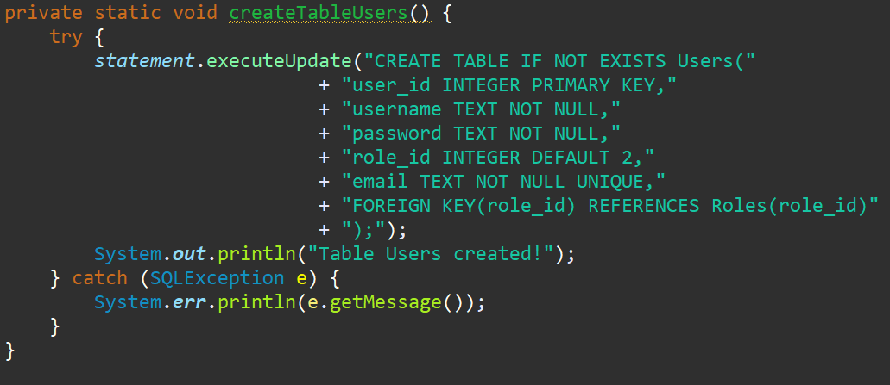

# SMDLIB Simple Library Management System

**This project is made in Java 21!**

Tutorial of how to run and test the program can be found in **TUTORIAL.TXT**

## Project Overview:
The SMDLIB Simple Library Management System enables users to borrow and add books to a common book database. This way users can save money and resources and manage them more effectively.
The users can be either a regular user or an library/system admin, each having different authority.
As said, users can borrow, return and add books. The admin can do the same thing but he can also remove/add books for users and manage users.
Everything is done through understandable client UI and effective and safe server.

## Technology Stack:
In our project, we have 3 layers with RESTfulAPI between the first 2:
1. **JavaFX client** - dopis
2. **Spring Boot** - server side Java framework for proccessing requests and security
3. **SQLite database** - to be specific, we choose SQLite3 and it is not a in-memory database, so after server restart we won't loose our stored data

As said, between layers **1** and **2** we implemented **RESTful API** to handle requests from the client using http methods (CRUD)

## Classes and Functions:
The server has 5 main types of classes based on what they do. They are also grouped up into packages.

1. **Model** - It is a Spring Boot object, usually a record for containing for example a user, book, transaction. So basically a certain instance of a object and the model class the blueprint of how should the instance look like.
   
2. **Repository** - The repository (repo) is responsible for interacting with the SQLite database and either retrieve or manage data. Here lies the logic behind data interaction.
3. **Controller** - Controllers are the "dumb" classes, because they do nothing but exchange data between their endpoints and either the repositories or clients. Here are the CRUD functions implemented.
4. **Security** - Here we put the SecurityConfig, JWT files and other security related classes. AuthConroll is the only security class that is not here but in the Controllers package, because it has endpoints login and register.
   
5. **DTO** - Data Transfer Objects, are helpful classes that can carry the data to/from the server and client, we used it only to transfer data to/from Endpoints. Also, it is more convenient to send and proccess one object rather than multiple attributes of our models.
   

Also, out main class for the server is separated from these packages. Same goes for the database.

These functions are the most common in the Repository classes:

- print all objects
  

- print single object
  

- add new object
  

- add delete object
  

## RESTful API:
The RESTful API on the server side is communicating with the REST client with these given http methods:

**C**rud 1. **POST** - Needs a RequestBody that contains DTO in which is the data used for processing.

c**R**ud 2. **GET** - Retrieves data for the user, it can be anything, doesn't have to be a DTO.

cr**U**d 3. **PUT** - Updates the column of the selected row in the database table. Uses DTO.

cru**D** 4. **DELETE** - Rarely used, but mostly only admin has the right to use this method. Uses DTO.

## Database Design:
The database file can be found next to the server src/ folder at Database/LIBDB.db with the database controller Classes
We have 4 tables to work with:

**Users**: Contains all users, including admins, has all the info you need about users

**Books**: The library of our database, the books and their info are here

**Borrows**: A logging table, which just contains the history of user made borrows and returns of books

**Roles**: A help table to more easily determine who is the admin and who is the user

## User Interface: to si dopln

## Challenges and Approach:
### Main Challenges

1. we have to implent SERVER-CLIENT architecture
2. implement RESTfulAPI and its CRUD functions
3. setup a SQLite database as our main storage
4. secure our server with roles and register/login
5. give the users a UI Client to communicate with our server

### Our approuch
1. using Spring Boot as our server framework, we easily achieved this goal
2. Spring boot offers http methods like GET, POST, PUT and DELETE to achieve CRUD
3. we connected to our database with JDBC and manage it via Java on the server
4. secure our server with Spring Boot Security using a JWT to keep users logged in
5. our UI is made with JavaFX Spring Boot client so users can interact with the server